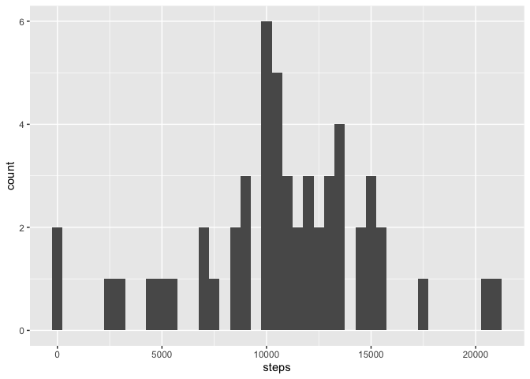
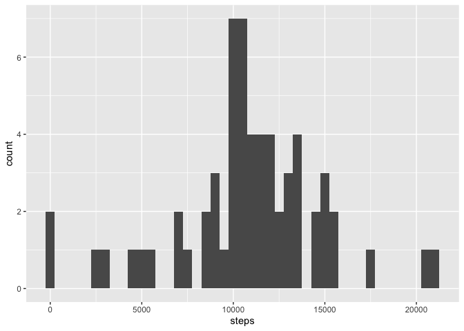
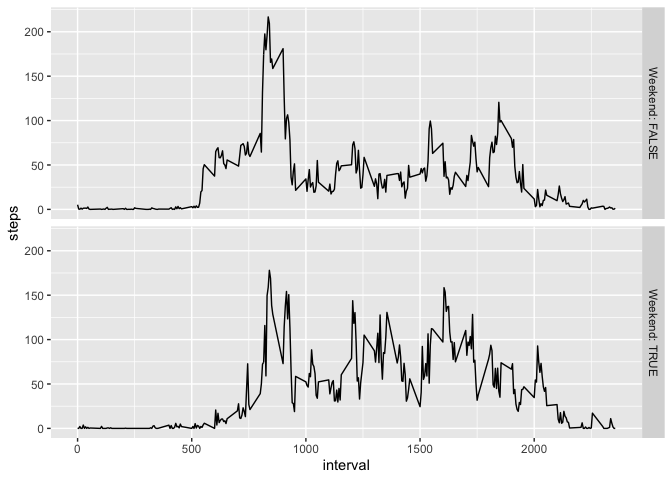

## Loading and preprocessing the data

Assuming the working directory has been set appropriately, the following code loads the dataset. The read_csv package in readr handles the zip file much better than read.csv.


```r
library(readr)
library(dplyr)
```

```
## 
## Attaching package: 'dplyr'
```

```
## The following objects are masked from 'package:stats':
## 
##     filter, lag
```

```
## The following objects are masked from 'package:base':
## 
##     intersect, setdiff, setequal, union
```

```r
library(ggplot2)
df.raw <- read_csv("activity.zip")
```

```
## Parsed with column specification:
## cols(
##   steps = col_double(),
##   date = col_date(format = ""),
##   interval = col_double()
## )
```

```r
df <- filter(df.raw,!is.na(steps))
```

## What is mean total number of steps taken per day?

To get this information, I group_by the date and then apply the summarize function from dplyr.


```r
dfgrouped <- group_by(df,date)
daily.steps <- summarize(dfgrouped,steps= sum(steps,na.rm = TRUE))
ggplot(daily.steps,aes(x=steps)) +geom_histogram(binwidth=500)
```

<!-- -->

```r
mean(daily.steps$steps)
```

```
## [1] 10766.19
```

```r
median(daily.steps$steps)
```

```
## [1] 10765
```

## What is the average daily activity pattern?

We now consider the distribution of steps over the course of the day, and identify the maximum number of steps.


```r
df.interval.grouped <- group_by(df,interval)
avg.per.interval <- summarize(df.interval.grouped, steps=mean(steps))
ggplot(avg.per.interval,aes(x=interval,y=steps)) +geom_line()
```

<!-- -->

```r
avg.per.interval$interval[which.max(avg.per.interval$steps)]
```

```
## [1] 835
```
This shows a clear peak of activity around 8:35am, which is consistent with people commuting to work and school.

## Imputing missing values

We first count the number of missing values.

```r
num.missing <- nrow(df.raw)-nrow(df)
```
To fill in the missing values, I use the mice package.


```r
library(mice)
```

```
## Loading required package: lattice
```

```
## 
## Attaching package: 'mice'
```

```
## The following objects are masked from 'package:base':
## 
##     cbind, rbind
```

```r
temp.data <- mice(df.raw,m=3,maxit=10,meth='pmm',seed=500)
completed.data <- complete(temp.data,1)
```

We now repeat our analysis of daily steps with this imputed data:

```r
Complete.grouped <- group_by(completed.data,date)
complete.daily.steps <- summarize(Complete.grouped,steps= sum(steps,na.rm = TRUE))
ggplot(complete.daily.steps,aes(x=steps)) + geom_histogram(binwidth=500)
```

<!-- -->

```r
mean(complete.daily.steps$steps)
```

```
## [1] 10783.36
```

```r
median(complete.daily.steps$steps)
```

```
## [1] 10765
```

While the median is unchanged, the mean has increased slightly due to imputation.

## Are there differences in activity patterns between weekdays and weekends?
I first use the weekdays function to assign days of the week to each observation, and then code whether the day is a weekend or a weekday.

```r
df.weekdays <- mutate(completed.data, Day = weekdays(date))
df.weekdays <- mutate(df.weekdays, Weekend =(Day == "Sunday" | Day == "Saturday"))
df.weekdays.grouped <- group_by(df.weekdays, interval, Weekend)
df.weekdays.means <- summarize(df.weekdays.grouped, steps= mean(steps))
```
We now plot the two series to see if there are any obvious differences.

```r
ggplot(df.weekdays.means,aes(x=interval,y=steps)) + geom_line() +facet_grid(Weekend ~.,labeller = label_both)
```

<!-- -->
